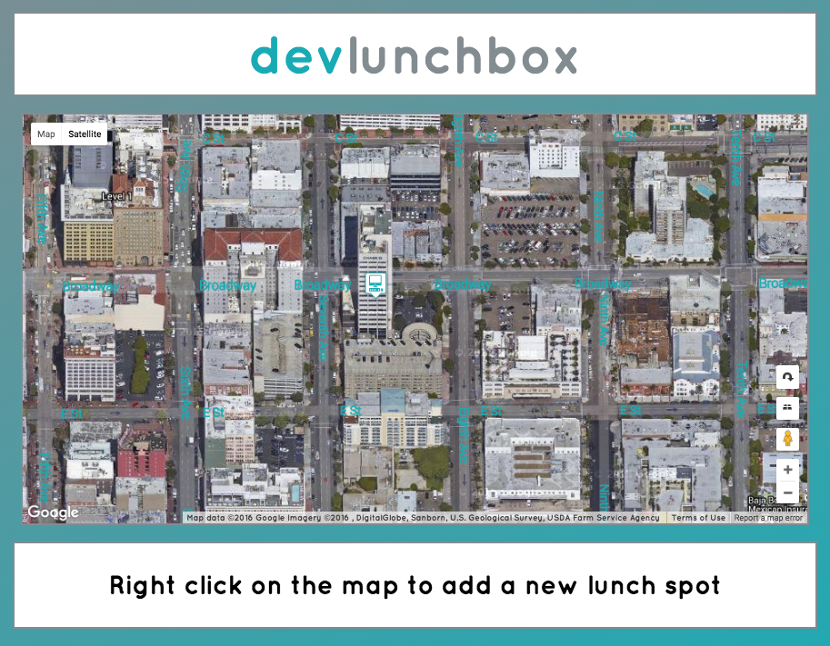

_(In progress)_

This is a one-page Rails app.  Its purpose is to hold a list of lunch spots around the DBC campus that students can reference and/or add to.

The Ruby version is 2.1.0, and the Rails version is 4.2.4.

To view the app, first make a local clone of the repo, run `bundle install` and then `rails s` to run a local server, which can be accessed through the browser at 'localhost:3000'.

Screenshot of the app

